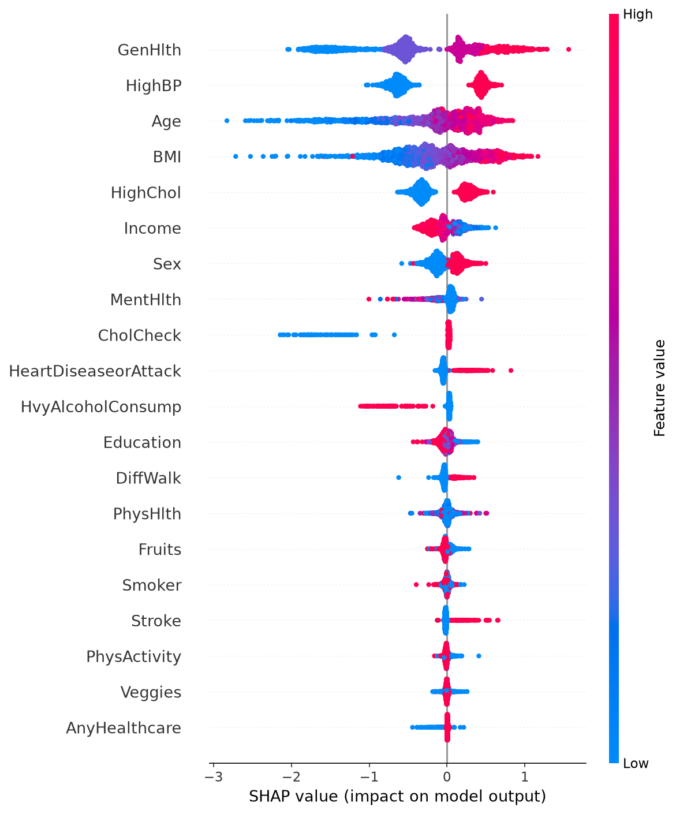
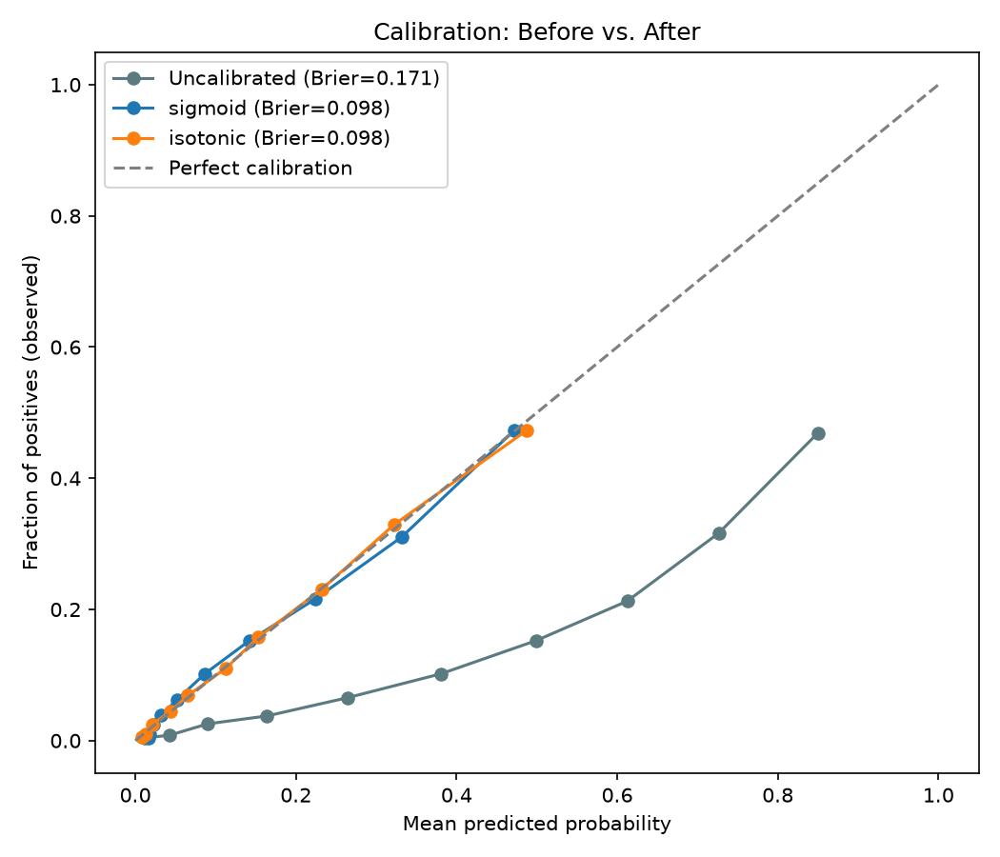
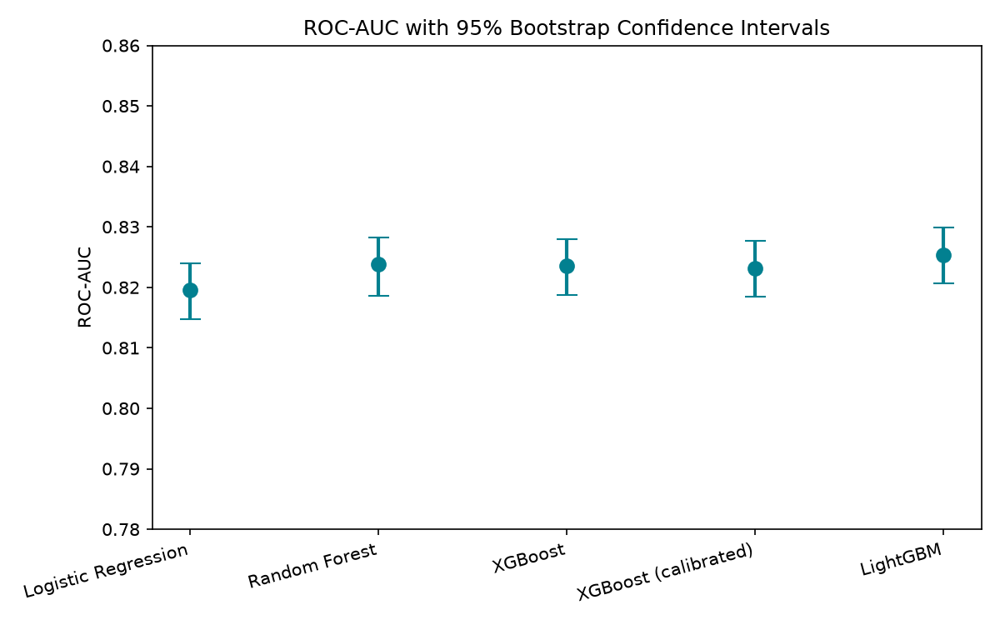
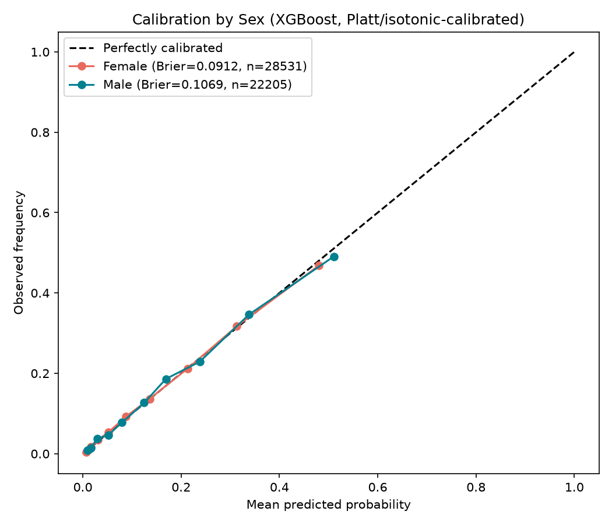

# Explainable & Calibrated ML for Diabetes Risk Prediction

A reproducible machine learning pipeline for diabetes risk classification on the CDC Diabetes Health
Indicators dataset (BRFSS 2015), comparing Logistic Regression, Random Forest, and XGBoost, with particular emphasis on probability calibration and SHAP-based interpretability, which are less
commonly evaluated alongside discrimination and subgroup analysis in comparable diabetes-risk studies.

## Key Real Findings

| Model | ROC-AUC | F1 | Brier Score | Notes |
|---|---|---|---|---|
| Logistic Regression | 0.8196 | 0.4413 | 0.1776 | Interpretable baseline |
| Random Forest | 0.8238 | 0.4415 | 0.1738 | Regularized: `max_depth=12`, `min_samples_leaf=20` |
| XGBoost | 0.8236 | 0.4422 | 0.1714 | `scale_pos_weight=6.177` for imbalance |
| LightGBM | **0.8254** | 0.4415 | 0.1734 | Highest raw ROC-AUC and PR-AUC of any model tested |
| XGBoost (calibrated, isotonic) | 0.8232 | 0.2162 @ thresh=0.5 | **0.0981** | Best of sigmoid vs. isotonic (near-tied) |
| XGBoost (calibrated, tuned threshold=0.245) | 0.8232 | **0.4652** | 0.0981 | Best F1 of any configuration |

Note: this analysis reports subgroup performance and calibration differences, not a formal fairness
audit. It does not test against defined fairness criteria (e.g. demographic parity, equalized odds).

*Confirmed reproducible: identical to 4 decimal places across two independent full pipeline runs.*

**Headline findings:**
- **Ensemble methods significantly outperform the linear baseline** — Random Forest, XGBoost, and
  LightGBM all beat Logistic Regression by a real, statistically significant margin (bootstrap 95% CI
  excludes 0: RF vs. LR = +0.0042 AUC [0.0025, 0.0056]; XGBoost vs. LR = +0.0040 AUC [0.0019, 0.0058]).
- **Random Forest and XGBoost are statistically indistinguishable from each other**
  (+0.0002 AUC, 95% CI [-0.0013, +0.0017], includes 0).
- **LightGBM has a small but statistically significant edge over both** (XGBoost vs. LightGBM:
  -0.0018 AUC, 95% CI [-0.0026, -0.0009]; Random Forest vs. LightGBM: -0.0016 AUC, 95% CI
  [-0.0028, -0.0004] — both exclude 0). This is a genuine, reproducible finding, but a useful
  reminder that **statistical significance is not the same as practical significance**: with a
  50,736-case test set, the bootstrap is sensitive enough to detect a ~0.002 AUC difference, which is
  far below any threshold that would change a real-world screening decision. LightGBM's histogram-based
  leaf-wise growth gives it a measurable but clinically negligible edge on this dataset.
- **Calibration doesn't hurt ranking ability.** XGBoost vs. its calibrated version shows no
  significant AUC difference (+0.0004, CI includes 0) — as expected, since calibration is a monotonic
  transform. You get the 43% Brier Score improvement "for free," without sacrificing discrimination.
- Raw XGBoost (trained with imbalance correction) is **badly over-confident**: at a predicted
  probability of ~0.62, the true observed rate is only ~0.21. Calibration brings predicted/observed
  probabilities into close agreement.
- Real SHAP analysis identifies **General Health, High Blood Pressure, Age, BMI, and High Cholesterol**
  as the top 5 predictors, consistent with prior literature (Rafie et al. 2025; Kutlu et al. 2024).

*Statistical rigor: all significance claims based on 1,000-resample paired bootstrap (95% CI) on the
held-out test set, cross-validated against independent stratified 5-fold CV (see `figures/cv_all_models_summary.csv`
and `figures/pairwise_significance.csv`).*

### SHAP Feature Importance



### Calibration: Raw vs. Sigmoid vs. Isotonic



## Dataset

**CDC Diabetes Health Indicators** (derived from the 2015 BRFSS, cleaned version)
- 253,680 records, 21 features, binary target (`Diabetes_binary`)
- Class imbalance: 6.18:1 (13.93% positive rate)
- Zero missing values
- Source: [UCI ML Repository, DOI: 10.24432/C53919](https://doi.org/10.24432/C53919)

```powershell
# Download (one-time manual step — not a persisted script)
curl -L -o data/diabetes.csv "https://raw.githubusercontent.com/Helmy2/Diabetes-Health-Indicators/main/diabetes_binary_health_indicators_BRFSS2015.csv"
```

## Project Structure

```
diabetes-prediction/
├── data/
│   └── diabetes.csv                    # raw dataset (not committed — see .gitignore)
├── models/                             # trained model artifacts (not committed — see .gitignore)
│   ├── split.pkl                       # train/test split + scaler
│   ├── logreg.pkl
│   ├── random_forest.pkl
│   ├── xgboost.pkl
│   └── xgboost_calibrated.pkl
├── figures/                            # generated plots and result tables
├── requirements.txt
├── requirements-exact.txt              # pinned versions from `pip freeze`
├── 02_inspect_data.py                  # data shape, missingness, target distribution
├── 03_feature_types.py                 # classify features (binary / ordinal / continuous)
├── 04_split_and_scale.py               # stratified train/test split + StandardScaler
├── 05_train_logreg.py                  # Logistic Regression baseline
├── 06_train_rf.py                      # Random Forest (regularized)
├── 07_train_xgb.py                     # XGBoost with imbalance correction
├── 08_compare_models.py                # side-by-side metric comparison
├── 09_calibrate.py                     # Brier Score + Platt scaling
├── 10_threshold_tuning.py              # precision/recall/F1 vs. decision threshold
├── 11_shap_explainability.py           # SHAP analysis (global importance + summary plot)
├── 12_shap_local_example.py            # per-patient SHAP waterfall explanation
├── 13_final_summary.py                 # consolidated results table across all models
├── 14_statistical_significance.py      # bootstrap 95% CIs + pairwise significance tests
├── 15_cv_all_models.py                 # independent 5-fold CV spread for LR, RF, XGBoost
├── 16_subgroup_fairness.py             # calibration/AUC breakdown by Sex, Age, Income
└── 17_train_lgbm.py                    # LightGBM (closes the "not yet trained" open item)
```


## Setup

```powershell
python -m venv venv
venv\Scripts\Activate.ps1
pip install -r requirements.txt
```

## Reproducing the Results

Run the scripts in numeric order:

```powershell
python 02_inspect_data.py
python 03_feature_types.py
python 04_split_and_scale.py
python 05_train_logreg.py
python 06_train_rf.py
python 07_train_xgb.py
python 08_compare_models.py
python 09_calibrate.py
python 10_threshold_tuning.py
python 11_shap_explainability.py
python 12_shap_local_example.py
python 13_final_summary.py
python 14_statistical_significance.py
python 15_cv_all_models.py
python 16_subgroup_fairness.py
python 17_train_lgbm.py
```

Each script saves its trained model/artifacts to `models/` and any figures/tables to `figures/`, so
later scripts can reuse earlier outputs without recomputing from scratch.

## Methodology Summary

1. **Preprocessing** — stratified 80/20 train/test split (preserves 13.93% positive rate in both sets);
   `StandardScaler` fit on training data only (used for Logistic Regression).
2. **Models** — Logistic Regression (`class_weight="balanced"`), Random Forest
   (`max_depth=12, min_samples_leaf=20, class_weight="balanced"`), XGBoost
   (`scale_pos_weight` set to the true class ratio).
3. **Evaluation** — Precision, Recall, F1, ROC-AUC, PR-AUC, confusion matrix; stratified 5-fold CV
   used to confirm stability (XGBoost: 0.8282 ± 0.0022 across folds).
4. **Calibration** — Brier Score compared across **both sigmoid (Platt) and isotonic calibration**
   (`CalibratedClassifierCV`), with the better-performing method (isotonic, in this run — 0.0981 vs.
   0.0981 sigmoid, effectively tied) saved as the final calibrated model; reliability diagrams via
   `sklearn.calibration.calibration_curve`.
5. **Threshold tuning** — precision/recall/F1 swept across all thresholds on the calibrated model's
   output to find the F1-optimal cutoff (0.245) and a high-recall operating point (0.160, ~75% recall).
6. **Explainability** — SHAP `TreeExplainer` on XGBoost (3,000-case test sample), both global (summary
   plot, mean |SHAP|) and local (single-patient waterfall) explanations.
7. **Statistical significance** — 1,000-resample paired bootstrap on the test set for 95% confidence
   intervals on ROC-AUC and Brier Score; pairwise comparisons test whether observed differences
   between models are distinguishable from noise, cross-validated against independent stratified
   5-fold CV spreads for all three base models.

### ROC-AUC with 95% Bootstrap Confidence Intervals



## Subgroup Performance & Calibration Analysis

None of the six papers reviewed in this proposal's literature review tested whether performance and
calibration hold up **across demographic subgroups** — so this pipeline includes that check. The
results reveal real, non-trivial disparities:

| Group | Subgroup | N | Prevalence | ROC-AUC | Brier (calibrated) | Recall (tuned thresh) |
|---|---|---|---|---|---|---|
| Sex | Female | 28,531 | 12.9% | 0.8334 | 0.0912 | 0.594 |
| Sex | Male | 22,205 | 15.2% | 0.8093 | 0.1069 | 0.607 |
| Age | 18-39 | 7,749 | 3.3% | 0.8367 | 0.0282 | **0.194** |
| Age | 40-59 | 18,361 | 10.6% | 0.8316 | 0.0783 | 0.528 |
| Age | 60+ | 24,626 | 19.7% | **0.7698** | **0.1348** | 0.651 |
| Income | Lower (1-4) | 11,418 | 22.7% | 0.7812 | 0.1455 | 0.731 |
| Income | Higher (5-8) | 39,318 | 11.4% | 0.8244 | 0.0843 | 0.525 |

**Key subgroup findings:**
- **Discrimination and calibration both degrade with age.** ROC-AUC drops from 0.837 (18-39) to 0.770
  (60+), and Brier Score nearly quintuples (0.028 -> 0.135) over the same range.
- **The globally-tuned threshold badly under-serves young adults.** Recall for ages 18-39 is only
  0.194 at the threshold tuned on the full population (0.245) — not a discrimination failure (this
  group has the *best* AUC of any age bucket) but a threshold-calibration failure, since diabetes
  prevalence in this group (3.3%) is far below the population average (13.9%) the threshold was tuned
  against. Per-subgroup threshold tuning is a clear, actionable fix.
- **A notable disparity in income:** lower-income individuals have nearly double the diabetes
  prevalence of higher-income individuals (22.7% vs. 11.4%) — meaning they need the model to work well
  *more* — but the model both discriminates (AUC 0.781 vs. 0.824) and calibrates (Brier 0.146 vs.
  0.084) worse for this group.
- Sex shows a smaller but real gap (AUC 0.809 Male vs. 0.833 Female).

### Calibration by Sex



## Known Issues / Open Items

- [x] ~~Consolidate `09_shap_explain.py` and `12_shap_explainability.py`~~ — resolved: removed the
  superseded draft (`09_shap_explain.py`, which pointed at a non-existent `outputs/` folder and used
  an older SHAP API); renumbered remaining scripts to close the gap.
- [x] ~~Full pipeline re-run after renumbering~~ — confirmed working end-to-end, all 12 scripts (`02`
  through `13`) run cleanly in sequence with no import/path errors.
- [ ] Consolidate output folders: `08`, `09`, `10` currently save to `outputs/` while `11`, `12`, `13`
  save to `figures/` — merge into a single `figures/` folder for consistency.
- [x] ~~Add statistical significance testing~~ — resolved: bootstrap 95% CIs + pairwise significance
  tests (`14_statistical_significance.py`) confirm ensemble methods significantly outperform Logistic
  Regression, but Random Forest and XGBoost are statistically indistinguishable from each other.
- [x] ~~Consider a subgroup calibration check~~ — resolved: `16_subgroup_fairness.py` found real
  disparities by Age (AUC 0.837 for 18-39 vs. 0.770 for 60+) and Income (lower-income group has 2x
  the diabetes prevalence but worse model calibration) — see Subgroup Performance & Calibration
  Analysis section above.
- [ ] Investigate per-subgroup threshold tuning to fix the low-recall issue for ages 18-39
- [ ] Add a dedicated `01_download_data.py` for full one-command reproducibility
- [x] ~~LightGBM was discussed but not yet trained/evaluated~~ — resolved: `17_train_lgbm.py` trained
  and bootstrap-tested; LightGBM has the highest raw ROC-AUC (0.8254) of any model, a statistically
  significant (but practically negligible, ~0.002 AUC) edge over Random Forest and XGBoost.

## License / Data Attribution

Dataset: CDC Diabetes Health Indicators, UCI Machine Learning Repository, DOI: 10.24432/C53919.
Code in this repository is original work for a research proposal on explainable, calibrated ML for
diabetes risk prediction.